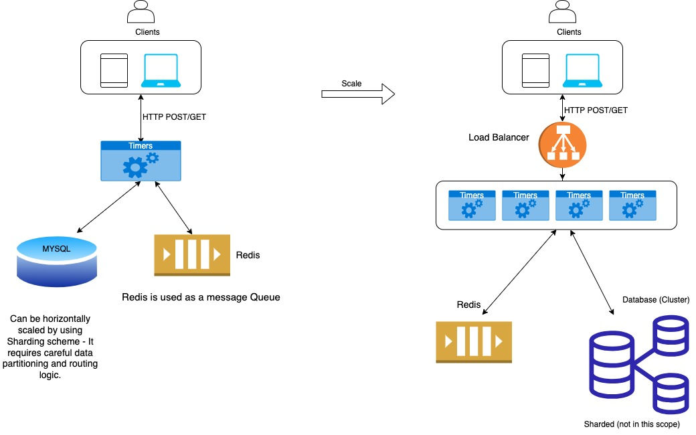

# Timer Service

The Timer Service is a Node.js application that allows users to easily execute scheduled tasks.

## Table of Contents

- [Timer Service](#timer-service)
  - [Table of Contents](#table-of-contents)
  - [Features](#features)
  - [Installation (Dockerized)](#installation-dockerized)
  - [Usage](#usage)
    - [Creating a Timer](#creating-a-timer)
  - [Checking Timer Status](#checking-timer-status)
  - [Webhook Integration](#webhook-integration)
  - [High-Level System Design](#high-level-system-design)
  - [Architecture](#architecture)
  - [Database Schema and Setup](#database-schema-and-setup)
    - [Table: timers](#table-timers)
    - [Below is a breakdown of the table schema:](#below-is-a-breakdown-of-the-table-schema)
  - [Creating the Timers Table](#creating-the-timers-table)
  - [Connection Pool](#connection-pool)
  - [Additional Requirements](#additional-requirements)
    - [Handling Invalid Inputs](#handling-invalid-inputs)
    - [Resilience Against Process Restarts](#resilience-against-process-restarts)
    - [Horizontal Scalability](#horizontal-scalability)
      - [Database:](#database)
      - [Connection Pooling:](#connection-pooling)
      - [Load Balancing:](#load-balancing)
  - [Ensuring Timers Are Fired Exactly Once](#ensuring-timers-are-fired-exactly-once)
    - [Distributed Locking:](#distributed-locking)
    - [Exclusive Execution:](#exclusive-execution)
    - [Lock Release:](#lock-release)
  - [Assumptions:](#assumptions)
  - [Retention Policy and Timer Scheduling](#retention-policy-and-timer-scheduling)
  - [Retention Policy:](#retention-policy)
    - [Simplified Logic and Database Maintenance:](#simplified-logic-and-database-maintenance)
    - [Scheduling Limit:](#scheduling-limit)
- [Scaling for High-Traffic Production Environments](#scaling-for-high-traffic-production-environments)
  - [Load Balancing](#load-balancing-1)
  - [Horizontal Scaling](#horizontal-scaling)
  - [Connection Pooling](#connection-pooling-1)
  - [Caching](#caching)
  - [Monitoring and Alerting](#monitoring-and-alerting)
  - [Optimization of Code and Queries](#optimization-of-code-and-queries)
  - [Rate Limiting and Throttling](#rate-limiting-and-throttling)
  - [Disaster Recovery and High Availability](#disaster-recovery-and-high-availability)
  - [Stress Testing](#stress-testing)
    - [Additional Notes](#additional-notes)
      - [Retry Logic (Out of scope)](#retry-logic-out-of-scope)
      - [Message Queueing for Long-Running Tasks (out of scope)](#message-queueing-for-long-running-tasks-out-of-scope)

## Features

- Create timers with customizable durations.
- Schedule timers for future execution.
- Check the status of a timer by ID.
- Automatic cleanup of completed timers.
- Distributed locking to prevent timer execution conflicts.
- Integration with external services through webhooks.

## Installation (Dockerized)

To run the Timer Service locally or on a server, follow these steps:

1. Open the downloaded zip file (or clone this repository: `git clone https://github.com/millerronen/timers.git)`
2. Navigate to the project directory: `cd timers`
3. Run the command: `docker-compose up -d --build` (docker should be installed on your machine).
4. Server should be running on localhost:3000 (You can check health by browsing: [localhost:3000/ping)](http://localhost:3000/ping)

## Usage

### Creating a Timer

To create a timer, send a **POST** request to the `/timers` endpoint with the following JSON body:

```json
{
  "hours": 1,
  "minutes": 30,
  "seconds": 0,
  "url": "http://your-webhook-url.com"
}
```

This JSON body represents a timer with a duration of 1 hour and 30 minutes that triggers a webhook at the specified URL upon completion.
Upon creating a timer, the service will respond with a JSON object containing the timer ID and the time left until execution:

```json
{
  "id": 1,
  "time_left": 5400
}
```

This response indicates that the timer with ID 1 has 5400 seconds (1 hour and 30 minutes) left until it triggers the webhook.

## Checking Timer Status

You can check the status of a timer by sending a **GET** request to the `/timers/:id` endpoint, where :id is the ID of the timer you want to check. The service will respond with a JSON object containing the timer ID and the time left until execution:

```json
{
  "id": 1,
  "time_left": 4900
}
```

## Webhook Integration

The Timer Service integrates with external services through webhooks. When a timer reaches its scheduled trigger time, the service will make a POST request to the specified URL, appending the timer ID as a path parameter. This allows external services to perform actions based on timer completion.

## High-Level System Design

Here's a high-level design of the Timer Service:


## Architecture

The Timer Service is built using Node.js and relies on the following technologies:

- Node.js: The core runtime for executing JavaScript on the server.
- MySQL: A relational database for storing timer data.
- Redis: In-memory data store for distributed locking and efficient timer scheduling.
- Express.js: A web application framework for handling HTTP requests.
- Axios: A promise-based HTTP client for making webhook requests.
- Distributed Locking: Prevents multiple instances from executing the same timer simultaneously.

## Database Schema and Setup

### Table: timers

The application uses a MySQL database to manage timers.
The timers table is responsible for storing timer information.

**Table: timers**

| Field        | Type                                       | Null | Key | Default           | Extra             |
| ------------ | ------------------------------------------ | ---- | --- | ----------------- | ----------------- |
| id           | int                                        | NO   | PRI | NULL              | auto_increment    |
| hours        | int                                        | YES  |     | NULL              |                   |
| minutes      | int                                        | YES  |     | NULL              |                   |
| seconds      | int                                        | YES  |     | NULL              |                   |
| url          | varchar(255)                               | YES  |     | NULL              |                   |
| start_time   | timestamp                                  | YES  |     | CURRENT_TIMESTAMP | DEFAULT_GENERATED |
| trigger_time | timestamp                                  | YES  |     | NULL              |                   |
| status       | enum('pending', 'processing', 'completed') | YES  | MUL | pending           |                   |

### Below is a breakdown of the table schema:

- id (INT AUTO_INCREMENT PRIMARY KEY): A unique identifier for each timer.
- hours (INT): The number of hours for the timer.
- minutes (INT): The number of minutes for the timer.
- seconds (INT): The number of seconds for the timer.
- url (VARCHAR(255)): An optional URL associated with the timer.
- start_time (TIMESTAMP DEFAULT CURRENT_TIMESTAMP): The timestamp when the timer was created.
- trigger_time (TIMESTAMP): The timestamp when the timer is scheduled to trigger.
- status (ENUM('pending', 'completed') DEFAULT 'pending'): The status of the timer, which can be 'pending' or 'completed'.
- INDEX idx_status_trigger_time (status, trigger_time): An index that can be used to optimize queries involving timer status and trigger time.

## Creating the Timers Table

The createTimersTableIfNotExists function in my code is responsible for creating the timers table if it doesn't already exist.
It ensures that the table is set up correctly during application startup.

## Connection Pool

The application also utilizes a connection pool for efficient database connections.
The pool is configured with a limit of 10 connections, but we can adjust this based on our specific needs.

```javascript
const pool = mysql.createPool({
  host: config.database.host,
  port: config.database.port,
  user: config.database.user,
  password: config.database.password,
  database: config.database.databaseName,
  waitForConnections: true,
  connectionLimit: 10, // Adjust this based on your needs
  queueLimit: 0,
});

module.exports = pool;
```

## Additional Requirements

### Handling Invalid Inputs

The application has been designed to handle invalid inputs gracefully.
When users provide incorrect or unexpected inputs, the application performs input validation to ensure that only valid data is processed.
Invalid inputs are logged, and appropriate error messages are generated to guide users in providing correct input.

### Resilience Against Process Restarts

To ensure that timers are not canceled by process restarts, the application stores timer data persistently in the database.
Timers are scheduled with a trigger_time, and even if the application is temporarily offline or restarted, timers that expired during that period will still be triggered once the application comes back online.
This ensures that timer events are not lost due to process interruptions.

### Horizontal Scalability

The solution has been architected to support horizontal scalability, allowing it to run on multiple servers to handle an increasing number of timers. Key components of horizontal scalability include:

#### Database:

The database used for storing timer data is scalable and can handle a growing number of records efficiently.

#### Connection Pooling:

The application employs a connection pool to efficiently manage database connections, ensuring that multiple server instances can access the database without overwhelming it.

#### Load Balancing:

If deployed across multiple servers, a load balancer can be used to evenly distribute incoming requests among server instances, ensuring even workload distribution.

## Ensuring Timers Are Fired Exactly Once

### Distributed Locking:

Before processing the timer, our application uses Redis to acquire a distributed lock.
This lock ensures that only one server instance can proceed to handle the timer.

### Exclusive Execution:

With the distributed lock in place, only a single server instance can access and process the timer.
This guarantees that the timer is fired exactly once, regardless of how many server instances are running.

### Lock Release:

After the timer has been processed, the distributed lock is released, allowing other timer events to be processed in the future.

By employing Redis and distributed locking, we ensure that timers are processed in a highly coordinated and reliable manner.

## Assumptions:

## Retention Policy and Timer Scheduling

In the design of this application, an assumption has been made regarding the retention policy and timer scheduling to simplify application logic and database maintenance:

## Retention Policy:

The application implements a retention policy of **30 days**.
This policy dictates that timers are automatically removed from the system once they become older than the retention period.
This approach serves several purposes:

### Simplified Logic and Database Maintenance:

The retention policy streamlines database maintenance by ensuring that outdated timer data is automatically purged.
This prevents the database from accumulating an excessive amount of historical timer records.

### Scheduling Limit:

In conjunction with the **30-days** retention policy, the application assumes that timers can be scheduled no more than 30 days into the future.
This assumption simplifies application logic and further contributes to efficient database maintenance.

# Scaling for High-Traffic Production Environments

To support a high-traffic production environment, where the application receives approximately **100** timer creation requests per second, several strategies and optimizations have been implemented:

## Load Balancing

A load balancer is deployed to distribute incoming requests evenly among multiple server instances. This ensures that no single server is overwhelmed by the traffic, and the system can effectively handle the load.

## Horizontal Scaling

The application architecture supports horizontal scaling, allowing for the dynamic addition of server instances as traffic increases. This elasticity ensures that the system can handle higher volumes of timer creation requests without a degradation in performance.

## Connection Pooling

To efficiently manage database connections and prevent connection bottlenecks, a connection pooling mechanism is in place. This ensures that database resources are utilized effectively and that the database can handle the high request rate.

## Caching

Where applicable, caching mechanisms are employed to reduce the load on the database. Frequently accessed or static data is cached to minimize database queries and response times.

## Monitoring and Alerting

Comprehensive monitoring and alerting systems are integrated into the application infrastructure. These systems provide real-time insights into application performance, server health, and database activity. Any anomalies or issues are detected promptly, allowing for proactive resolution.

## Optimization of Code and Queries

Code and database queries are continually optimized for performance. This includes query indexing, minimizing redundant operations, and profiling code to identify and address bottlenecks.

## Rate Limiting and Throttling

To prevent abuse and protect the system from excessive traffic, rate limiting and request throttling mechanisms are implemented. These mechanisms ensure that the system operates within its intended capacity.

## Disaster Recovery and High Availability

For business continuity, the application is designed with disaster recovery and high availability in mind. Redundancy measures and failover strategies are in place to minimize downtime and data loss in the event of unforeseen issues.

## Stress Testing

Regular stress testing is conducted to simulate high-traffic scenarios and identify potential weaknesses in the system. This proactive approach allows for adjustments and improvements before they impact production performance.

By implementing these strategies and optimizations, we are confident in our ability to support a high-traffic production environment, meeting the demands of **100** timer creation requests per second while maintaining system stability and reliability.

Certainly, you can include the information about retry logic in the "Additional Notes" section of your README.md file. Here's a generated section for your README.md:

### Additional Notes

#### Retry Logic (Out of scope)

In cases where the execution of a timer's task, such as the POST webhook request, encounters failures, it's essential to implement retry logic to ensure the task eventually succeeds. Retry logic helps in handling transient errors, network issues, or temporary unavailability of external services.

**Retry Strategies:**

1. **Exponential Backoff:** A common retry strategy is exponential backoff, where retries are attempted with increasing time intervals between them. For example, you might start with a short delay and double the delay duration with each subsequent retry.
2. **Retry Limits:** Set a maximum number of retry attempts to prevent endless retry loops in case of persistent issues. Once the maximum retry limit is reached, the system can take appropriate action, such as logging the failure or marking the timer as "failed."

**Handling Permanent Failures:**

While retry logic is crucial for transient issues, it's also essential to distinguish between transient and permanent failures. If a task repeatedly fails and retries are unsuccessful, consider marking the timer as "failed" and logging the error details for further investigation. This prevents endless retrying of tasks that are unlikely to succeed.

**Monitoring and Alerts:**

Monitoring and alerting mechanisms to keep track of task execution and retries - to notify administrators or developers when a task repeatedly fails beyond a certain threshold, enabling timely intervention.

**Resilient Webhooks:**

When dealing with webhooks, ensure that the external service receiving the webhook can handle retries gracefully. Many webhook consumers expect idempotent requests, meaning the same request can be safely repeated without unintended side effects.

#### Message Queueing for Long-Running Tasks (out of scope)

For tasks that have the potential to be long-running or resource-intensive, I considered implementing a message queuing mechanism. Message queues provide a way to offload and process tasks asynchronously, ensuring efficient resource utilization and scalability (also could have helped with the one time only timer triggering)

Key Benefits of Message Queues are: Scalability and Reliability.

Long-Running Tasks: Message queues are particularly useful for tasks that may take a significant amount of time to complete. They allow the timer service to continue processing other tasks while long-running tasks are handled separately.

Retry Mechanism: Message queues often include built-in retry mechanisms, allowing failed tasks to be retried automatically.

By documenting and implementing retry logic and message queuing, we enhance the resilience and reliability of the timer service, ensuring that tasks are eventually completed even in the face of occasional failures.
