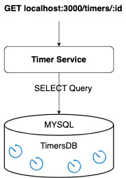

# Timer Service

The Timer Service is a Node.js application that allows users to easily execute scheduled tasks.

## Table of Contents

- [Timer Service](#timer-service)
  - [Table of Contents](#table-of-contents)
  - [Features](#features)
  - [Installation (Dockerized)](#installation-dockerized)
  - [Usage](#usage)
    - [Creating a Timer](#creating-a-timer)
  - [Checking Timer Status](#checking-timer-status)
  - [Webhook Integration](#webhook-integration)
  - [High-Level System Design](#high-level-system-design)
  - [Architecture](#architecture)
    - [Application Flow](#application-flow)
      - [Create Timer Basic Flow](#create-timer-basic-flow)
      - [Check Expired Timers Flow](#check-expired-timers-flow)
      - [Get Timer Status Flow](#get-timer-status-flow)
      - [Cleanup Completed Timers Flow](#cleanup-completed-timers-flow)
  - [Database Schema and Setup](#database-schema-and-setup)
    - [Table: timers](#table-timers)
    - [Below is a breakdown of the table schema:](#below-is-a-breakdown-of-the-table-schema)
  - [Creating the Timers DB and Timers Table](#creating-the-timers-db-and-timers-table)
  - [Connection Pool](#connection-pool)
  - [The Timer status as a state machine](#the-timer-status-as-a-state-machine)
    - [Timer Status Explanation:](#timer-status-explanation)
  - [Additional Requirements](#additional-requirements)
    - [Handling Invalid Inputs](#handling-invalid-inputs)
    - [Resilience Against Process Restarts](#resilience-against-process-restarts)
    - [Horizontal Scalability](#horizontal-scalability)
      - [Database:](#database)
      - [Connection Pooling:](#connection-pooling)
      - [Load Balancing:](#load-balancing)
  - [Ensuring Timers Are Fired Exactly Once](#ensuring-timers-are-fired-exactly-once)
  - [Assumptions Made:](#assumptions-made)
  - [Retention Policy and Timer Scheduling](#retention-policy-and-timer-scheduling)
  - [Retention Policy:](#retention-policy)
    - [Simplified Logic and Database Maintenance:](#simplified-logic-and-database-maintenance)
    - [Scheduling Limit:](#scheduling-limit)
- [Scaling for High-Traffic Production Environments](#scaling-for-high-traffic-production-environments)
    - [Additional Notes](#additional-notes)
      - [Timer Action Retry Logic (NOT IMPLEMENTED)](#timer-action-retry-logic-not-implemented)
      - [Message Queueing for Long-Running Tasks (NOT IMPLEMENTED)](#message-queueing-for-long-running-tasks-not-implemented)
      - [Ensuring Data Consistency with Transactions (NOT IMPLEMENTED)](#ensuring-data-consistency-with-transactions-not-implemented)
    - [Another system design approaches that I have considered before this one](#another-system-design-approaches-that-i-have-considered-before-this-one)

## Features

- Create timers with customizable durations.
- Schedule timers for future execution.
- Check the status of a timer by ID.
- Automatic cleanup of completed timers.
- Integration with external services through webhooks.

## Installation (Dockerized)

To run the Timer Service locally or on a server, follow these steps:

1. Open the downloaded zip file.
2. Navigate to the project directory: `cd timers`
3. Run the command: `docker-compose up -d --build` (you should have docker installed on your machine).
4. Server should be running on **localhost:3000** (You can check health by browsing: [localhost:3000/ping)](http://localhost:3000/ping)

## Usage

### Creating a Timer

To create a timer, send a **POST** request to the `/timers` endpoint with the following JSON body:

```json
{
  "hours": 1,
  "minutes": 30,
  "seconds": 0,
  "url": "http://your-webhook-url.com"
}
```

This JSON body represents a timer with a duration of 1 hour and 30 minutes that triggers a webhook at the specified URL upon completion.
Upon creating a timer, the service will respond with a JSON object containing the timer ID and the time left until execution:

```json
{
  "id": 1,
  "time_left": 5400
}
```

This response indicates that the timer with ID 1 has 5400 seconds (1 hour and 30 minutes) left until it triggers the webhook.

## Checking Timer Status

You can check the status of a timer by sending a **GET** request to the `/timers/:id` endpoint, where :id is the ID of the timer you want to check. The service will respond with a JSON object containing the timer ID and the time left until execution:

```json
{
  "id": 1,
  "time_left": 4900
}
```

## Webhook Integration

The Timer Service integrates with external services through webhooks. When a timer reaches its scheduled trigger time, the service will make a POST request to the specified URL, appending the timer ID as a path parameter. This allows external services to perform actions based on timer completion.

## High-Level System Design

Here's a high-level design of the Timer Service:


## Architecture

The Timer Service is built using Node.js and relies on the following technologies:

- Node.js: The core runtime for executing JavaScript on the server.
- MySQL: A relational database for storing timer data.
- Redis: In-memory data store for message queue processing.
- Express.js: A web application framework for handling HTTP requests.
- Axios: A promise-based HTTP client for making webhook requests.

### Application Flow

#### Create Timer Basic Flow


#### Check Expired Timers Flow


#### Get Timer Status Flow



#### Cleanup Completed Timers Flow


This diagrams illustrate the flow of the data and processes within the application.
It provides an overview of how different components interact and the sequence of actions.

## Database Schema and Setup

### Table: timers

The application uses a MySQL database to manage timers.
The timers table is responsible for storing timer information.

**Table: timers**

| Field        | Type                                        | Null | Key | Default           | Extra             |
| ------------ | ------------------------------------------- | ---- | --- | ----------------- | ----------------- |
| id           | int                                         | NO   | PRI | NULL              | auto_increment    |
| hours        | int                                         | YES  |     | NULL              |                   |
| minutes      | int                                         | YES  |     | NULL              |                   |
| seconds      | int                                         | YES  |     | NULL              |                   |
| url          | varchar(255)                                | YES  |     | NULL              |                   |
| start_time   | timestamp                                   | YES  |     | CURRENT_TIMESTAMP | DEFAULT_GENERATED |
| trigger_time | timestamp                                   | YES  |     | NULL              |                   |
| status       | enum('pending', 'proc.', 'comp.', 'failed') | YES  | MUL | pending           |                   |

### Below is a breakdown of the table schema:

- id (INT AUTO_INCREMENT PRIMARY KEY): A unique identifier for each timer.
- hours (INT): The number of hours for the timer.
- minutes (INT): The number of minutes for the timer.
- seconds (INT): The number of seconds for the timer.
- url (VARCHAR(255)): An optional URL associated with the timer.
- start_time (TIMESTAMP DEFAULT CURRENT_TIMESTAMP): The timestamp when the timer was created.
- trigger_time (TIMESTAMP): The timestamp when the timer is scheduled to trigger.
- status (ENUM('pending','processing','completed','failed') DEFAULT 'pending'): The status of the timer,
  which can be 'pending', or 'processing' or 'completed' or 'failed'.
- INDEX idx_status_trigger_time (status, trigger_time): An index that can be used to optimize queries involving
  timer status and trigger time.

## Creating the Timers DB and Timers Table

The createDatabaseIfNotExists and createTimersTableIfNotExists functions in my code is responsible for creating the timers db and table if it doesn't already exist.
It ensures that the db and its table is set up correctly during application startup.

## Connection Pool

The application also utilizes a connection pool for efficient database connections.
The pool is configured with a limit of 10 connections, but we can adjust this based on our specific needs.
In the event of a database connection failure or that it isn't ready yet when composing the containers for the first time, the code implements automatic retries with a maximum of 5 attempts, each spaced 5 seconds apart, before considering the issue as critical and exiting the application with exit(1)."

## The Timer status as a state machine


### Timer Status Explanation:

Pending: Timers start with a "pending" status. This means they are scheduled but have not yet been processed.

Processing: When a timer is actively being queued, its status changes to "processing."
This indicates that the system is currently going to perform the specified task associated with the timer.

Completed: After successfully executing the timer's task, its status is updated to "completed."
This means the timer's action has been carried out successfully.

Failed: If, for any reason, the timer's task cannot be completed, its status will be set to "failed."
This could occur due to various issues such as network problems, resource unavailability, or errors during execution.

## Additional Requirements

### Handling Invalid Inputs

The application has been designed to handle invalid inputs gracefully.
When users provide incorrect or unexpected inputs, the application performs input validation to ensure that only valid data is processed.
Invalid inputs are logged, and appropriate error messages are generated to guide users in providing correct input.

### Resilience Against Process Restarts

To ensure that timers are not canceled by process restarts, the application stores timer data persistently in the database.
Timers are scheduled with a trigger_time, and even if the application is temporarily offline or restarted, timers that expired during that period will still be triggered once the application comes back online.
This ensures that timer events are not lost due to process interruptions.

### Horizontal Scalability

The solution has been architected to support horizontal scalability, allowing it to run on multiple servers to handle an increasing number of timers. Key components of horizontal scalability include:

#### Database:

The database used for storing timer data is scalable and can handle a growing number of records efficiently.

#### Connection Pooling:

The application employs a connection pool to efficiently manage database connections, ensuring that multiple server instances can access the database without overwhelming it.

#### Load Balancing:

If deployed across multiple servers, a load balancer can be used to evenly distribute incoming requests among server instances, ensuring even workload distribution.

## Ensuring Timers Are Fired Exactly Once

In my code, a careful approach is taken to guarantee that timers are executed precisely once, avoiding any duplicate executions or missed timers.

Fetching Pending Timers: The code fetches timers from a database that have a status of "pending"
and are within a specified time window for execution.

Batch Processing: Timers are processed in batches to efficiently manage and enqueue them.
This batch processing helps maintain system performance, especially when dealing with a large number of timers.

Concurrency Control: For each timer in the batch, the code ensures that only one instance of the timer is marked as "processing"
using a database update. This step prevents multiple instances of the same timer from being processed simultaneously.

Enqueueing in Redis: After a timer is marked as 'processing,' it is added to a Redis **Sorted Set**.
This data structure ensures that timers are organized in chronological order based on their trigger times,
guaranteeing that the timer with the earliest trigger time will be processed first.
Additionally, it prevents the duplication of timers, ensuring that only unique timers are enqueued.

By adopting this approach, my code ensures that timers are processed accurately and exactly **once**, even in cases of system failures or crashes.

## Assumptions Made:

## Retention Policy and Timer Scheduling

In the design of this application, an assumption has been made regarding the retention policy and timer scheduling to simplify application logic and database maintenance:

## Retention Policy:

The application implements a retention policy of **30 days**.
This policy dictates that timers are automatically removed from the system once they become older than the retention period.
This approach serves several purposes:

### Simplified Logic and Database Maintenance:

The retention policy streamlines database maintenance by ensuring that outdated timer data is automatically purged.
This prevents the database from accumulating an excessive amount of historical timer records.

### Scheduling Limit:

In conjunction with the **30-days** retention policy, the application assumes that timers can be scheduled no more than 30 days into the future.
This assumption simplifies application logic and further contributes to efficient database maintenance.

# Scaling for High-Traffic Production Environments

To support a high-traffic production environment, where the application receives **100** (or more) timer creation requests per second, several strategies and optimizations have been **implemented** and can be considered (not implemented).

1. I have implementd a **batch processing** mechanism for timers that are expected to trigger within a given second.
   This can help manage high request rates more efficiently.
2. Appropriate **indexes** are created on the database tables to optimize query performance.
   In my case, consider indexing columns used frequently in queries, such as status and trigger_time.
3. We should consider **separating** the timer enqueuing (**producer**) and timer processing (**consumer**) processes.
   Separating these responsibilities can improve the scalability.
   By appropriate monitoring of the bottlenecks that we have, we can decide whether more producer and/or more consumers are needed.
4. Basic **rate limiting** and throttling mechanisms was used in order to control the rate of incoming timer requests.
   This prevents abuse and ensures fair resource allocation.
5. **Connection pool** is an important aspect of the application's scalability and performance when working with a MySQL database.
   We need to verify that the connection pool is configured optimally for this application's expected load.
   Key parameters to configure include the maximum number of connections: `connectionLimit`, idle connection timeout, and connection acquisition timeout. We should adjust these values based on the application's specific needs.
6. Database Sharding - If the database becomes a performance bottleneck, we should consider implementing database sharding to distribute data across
   multiple database instances.
7. Better sql queries and indexes should be considered for optimizations.

### Additional Notes

#### Timer Action Retry Logic (NOT IMPLEMENTED)

In cases where the execution of a timer's task, such as the POST webhook request, encounters failures, it's essential to implement retry logic to ensure the task eventually succeeds. Retry logic helps in handling transient errors, network issues, or temporary unavailability of external services.

**Retry Strategies:**

1. **Exponential Backoff:** A common retry strategy is exponential backoff, where retries are attempted with increasing time intervals between them. For example, we might start with a short delay and double the delay duration with each subsequent retry.
2. **Retry Limits:** Set a maximum number of retry attempts to prevent endless retry loops in case of persistent issues. Once the maximum retry limit is reached, the system can take appropriate action, such as logging the failure or marking the timer as "failed."

   For now, if the timer action fails - I am updating the status to "failed" for further investigation.
   Hence the timer action won't be triggered again if some failures happens inside this code section.
   Although I didn't implement such a retry logic for the timer process,
   I did implemented a retry logic for the DB and Table creation for not failing the app until mysql is ready.

**Handling Permanent Failures:**
While retry logic is crucial for transient issues, it's also essential to distinguish between transient and permanent failures.

#### Message Queueing for Long-Running Tasks (NOT IMPLEMENTED)

In certain scenarios, WE may encounter long-running tasks or background processes that are not suitable for immediate execution within THE application. Such tasks might include heavy data processing, sending bulk emails, generating reports, or other resource-intensive operations.
While Redis can serve as a basic queueing system for short-lived tasks, it may not be the best choice for managing long-running tasks efficiently.
In such cases, WE might consider using a dedicated message queuing system designed for handling these types of workloads.

#### Ensuring Data Consistency with Transactions (NOT IMPLEMENTED)

In a high-traffic and data-intensive application like this, maintaining data consistency between different storage systems is crucial.
I use both a relational database (MySQL) and Redis for storing and managing timer-related data.
To ensure that the data remains consistent, when interacting with both storage systems - transactions should be considered.

### Another system design approaches that I have considered before this one
